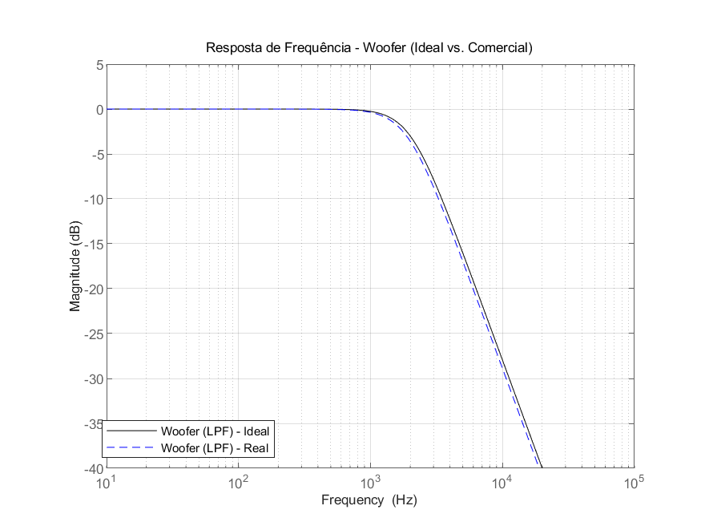
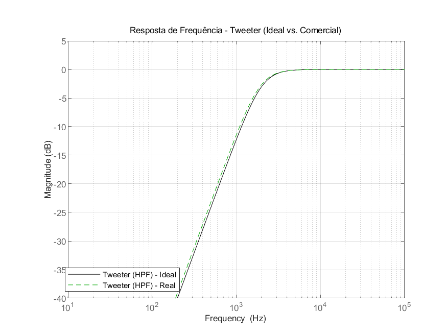

# Projeto e análise de Filtros Passivos 
**Instituição:** Universidade Tecnológica Federal do Paraná (UTFPR) – Campus Pato Branco  
**Autor:** Éricky Gomes Michels
**Disciplina:** Circuitos de Corrente Alternada
**Professor:** Prof. Lucas Bernardo Zilch  

---

## C. Apresentação do Problema
Em sistemas de áudio de duas vias, diferentes alto-falantes são utilizados para reproduzir faixas específicas do espectro sonoro. O woofer é responsável pela reprodução das baixas frequências (graves), enquanto o tweeter é destinado às altas frequências (agudos). Como cada transdutor apresenta características construtivas e operacionais distintas, a aplicação do sinal de áudio completo diretamente em ambos compromete a qualidade da reprodução sonora e pode ocasionar danos ao tweeter devido à presença de componentes de baixa frequência.

Para solucionar esse problema, emprega-se um crossover passivo, constituído por filtros elétricos que dividem o espectro de frequências e direcionam cada faixa ao alto-falante apropriado. Dessa forma, o woofer recebe predominantemente os sinais abaixo da frequência de corte, enquanto o tweeter reproduz os sinais acima desse valor, proporcionando uma resposta em frequência mais equilibrada e reduzindo distorções.

Neste trabalho, propõe-se o projeto de um crossover passivo utilizando filtros Butterworth de segunda ordem, compostos por elementos passivos (indutores e capacitores). Além do dimensionamento dos componentes ideais para uma frequência de corte e uma impedância especificadas, desenvolve-se uma ferramenta computacional capaz de selecionar valores comerciais equivalentes e comparar o desempenho teórico e prático por meio de diagramas de Bode, permitindo avaliar o impacto da substituição dos componentes ideais por componentes comerciais.

---

## D. Objetivos e Detalhes de Projeto
O objetivo deste projeto é desenvolver uma ferramenta computacional capaz de dimensionar um crossover passivo de duas vias utilizando filtros Butterworth de segunda ordem. A ferramenta deve calcular os valores ideais dos componentes passivos (indutores e capacitores), selecionar os valores comerciais mais próximos disponíveis e comparar o desempenho entre o projeto ideal e o projeto implementável por meio de gráficos de Bode.

Além do desenvolvimento da ferramenta, o projeto busca analisar o impacto da substituição dos componentes ideais por componentes comerciais, verificando as alterações na frequência de corte e na resposta em frequência dos filtros.

### Detalhes do projeto
* **Tipo de sistema**: crossover passivo para caixa acústica de duas vias.
* **Filtro do woofer**: filtro passa-baixas (LPF) Butterworth de 2ª ordem.
* **Filtro do tweeter**: filtro passa-altas (HPF) Butterworth de 2ª ordem.
* **Frequência de corte**: 2 kHz.
* **Impedância nominal da carga**: 8 Ω para ambos os alto-falantes.
* **Componentes utilizados**: indutores e capacitores passivos.
* **Seleção de componentes**: escolha dos valores comerciais mais próximos entre aqueles fornecidos nas tabelas do projeto.
* **Análise dos resultados**: comparação entre os valores ideais e comerciais dos componentes, bem como entre as respostas em frequência dos filtros por meio de diagramas de Bode.

---

## E. Funções de Transferência e Fórmulas de Projeto

Para o dimensionamento dos filtros Butterworth de 2ª ordem, considera-se uma frequência de corte (f_c) e uma carga resistiva (R). Inicialmente, calcula-se a frequência angular de corte por meio da expressão:

$$
\omega_c = 2\pi f_c
$$

Os valores ideais do indutor (L) e do capacitor (C) são calculados pelas seguintes equações:

$$
L=\frac{R}{\sqrt{2}\cdot \omega_c}
$$

$$
C=\frac{\sqrt{2}}{R \cdot \omega_c}
$$

Onde:

- **L**: indutância (H);
- **C**: capacitância (F);
- **R**: impedância da carga (Ω);
- **fc**: frequência de corte (Hz);
- **ωc**: frequência angular de corte (rad/s).

### Filtro Passa-Baixas (LPF)

A função de transferência utilizada para o filtro passa-baixas é:

$$
H_{LPF}(j\omega)=
\frac{\frac{1}{LC}}
{(j\omega)^2+\frac{R}{L}(j\omega)+\frac{1}{LC}}
$$

Essa função permite a passagem das baixas frequências e atenua as componentes acima da frequência de corte.

### Filtro Passa-Altas (HPF)

A função de transferência utilizada para o filtro passa-altas é:

$$
H_{HPF}(j\omega)=
\frac{(j\omega)^2}
{(j\omega)^2+\frac{R}{L}(j\omega)+\frac{1}{LC}}
$$

Essa função permite a passagem das altas frequências e atenua as componentes abaixo da frequência de corte.

---

## F. Explicação da Lógica do Programa

O programa foi desenvolvido em MATLAB e está dividido em duas etapas principais: o projeto do filtro passa-baixas (LPF), destinado ao woofer, e o projeto do filtro passa-altas (HPF), destinado ao tweeter. A lógica de execução segue a sequência descrita a seguir:

* **Definição dos parâmetros do projeto:** Inicialmente são definidos a impedância da carga (`R = 8 Ω`) e a frequência de corte (`fc = 2 kHz`). Em seguida, a frequência é convertida para frequência angular (`ωc`), necessária para as equações de dimensionamento.
* **Definição dos componentes comerciais:** O programa armazena em dois vetores os valores comerciais disponíveis para indutores e capacitores, que serão utilizados posteriormente para aproximar os valores ideais calculados.
* **Cálculo dos componentes ideais:** Utilizando as equações de projeto para filtros Butterworth de 2ª ordem, são calculados os valores ideais de indutância (`L`) e capacitância (`C`), que servem como referência para o projeto.
* **Seleção dos componentes comerciais:** Para cada componente ideal, o programa calcula a diferença absoluta entre o valor ideal e todos os valores disponíveis nas tabelas comerciais. Em seguida, seleciona automaticamente o componente que apresenta o menor erro em relação ao valor teórico.
* **Modelagem das funções de transferência:** Com os valores ideais e comerciais, são construídas as funções de transferência dos filtros passa-baixas e passa-altas por meio da função tf(), permitindo representar matematicamente o comportamento de cada filtro.
* **Geração dos diagramas de Bode:** As respostas em frequência dos filtros ideais e comerciais são calculadas e exibidas em gráficos de Bode. O programa configura os gráficos para apresentar a frequência em hertz, exibir apenas a magnitude da resposta e facilitar a comparação entre os projetos.
* **Apresentação e exportação dos resultados:** Por fim, o programa exibe no terminal os valores ideais e comerciais dos componentes e salva automaticamente os diagramas de Bode em arquivos de imagem, possibilitando sua utilização na documentação do projeto.

## G. Guia de Execução do Código
Para reproduzir os resultados e gráficos deste projeto, siga as instruções abaixo:

1. Certifique-se de possuir o **MATLAB** instalado com a toolbox **Control System Toolbox**.
2. Clone este repositório ou faça o download dos arquivos do projeto.
3. Abra o MATLAB e navegue até o diretório onde o arquivo foi salvo.
4. Abra o script no editor do MATLAB e clique no botão **Run** (Executar) ou digite `crossover_projeto` no *Command Window*.
5. O terminal exibirá os valores numéricos calculados e duas janelas de figuras interativas serão abertas. As imagens `.png` serão geradas automaticamente na mesma pasta do script.

---

## H. Análise dos Resultados

### Valores Obtidos

| Componente | Valor Ideal | Valor Comercial |
|------------|------------:|----------------:|
| Indutor (L) | 0,4502 mH | 0,47 mH |
| Capacitor (C) | 14,0674 µF | 15 µF |

Os componentes comerciais selecionados apresentaram valores muito próximos dos valores ideais calculados, resultando em pequenas diferenças na resposta em frequência dos filtros.

### Filtro Passa-Baixas (Woofer)

Observa-se que as curvas do filtro ideal e do filtro implementado com componentes comerciais praticamente se sobrepõem na banda passante, mantendo ganho próximo de 0 dB. A principal diferença ocorre nas proximidades da frequência de corte, onde o filtro comercial apresenta um pequeno deslocamento em relação ao projeto ideal devido à aproximação dos valores de indutância e capacitância. Após essa região, ambos os filtros mantêm a característica de atenuação de aproximadamente 40 dB por década (12 dB por oitava), conforme esperado para um filtro Butterworth de 2ª ordem.

### Filtro Passa-Altas (Tweeter)

O filtro passa-altas também apresentou comportamento muito próximo ao projeto ideal. A resposta obtida com os componentes comerciais sofreu apenas um pequeno deslocamento na região da frequência de corte, mantendo praticamente inalteradas as características do filtro. Acima da frequência de corte, ambas as curvas permanecem praticamente sobrepostas, indicando que a banda de passagem e a taxa de atenuação foram preservadas.

De forma geral, os resultados demonstram que a utilização de componentes comerciais produz respostas em frequência muito próximas das respostas ideais. As pequenas diferenças observadas concentram-se na região da frequência de corte e são consequência da indisponibilidade de componentes com os valores teóricos exatos, evidenciando que a implementação prática mantém desempenho bastante semelhante ao projeto original.

## I. Análise Crítica

Os componentes comerciais selecionados apresentaram pequenas diferenças em relação aos valores ideais calculados.

| Componente | Valor Ideal | Valor Comercial | Erro |
|------------|------------:|----------------:|------:|
| Indutor (L) | 0,4502 mH | 0,47 mH | +4,40% |
| Capacitor (C) | 14,0674 µF | 15 µF | +6,63% |
| Frequência de corte | 2000 Hz | 1897 Hz | −5,2%

Como consequência dessas aproximações, a frequência de corte do filtro implementado sofreu uma pequena alteração em relação ao valor teórico de 2 kHz. Entretanto, conforme observado nos diagramas de Bode, esse deslocamento foi pequeno e praticamente não alterou o comportamento geral dos filtros.

Na prática, a resposta em frequência dos filtros comerciais permaneceu muito próxima da resposta ideal. A banda passante, a região de transição e a taxa de atenuação característica do filtro Butterworth de 2ª ordem foram preservadas, indicando que os componentes escolhidos atendem adequadamente ao projeto.

Em um sistema de áudio real, essa pequena variação dificilmente seria percebida pelo ouvinte. As diferenças concentram-se na região da frequência de corte e são pequenas quando comparadas às tolerâncias normalmente encontradas em alto-falantes, componentes passivos e até mesmo na acústica do ambiente de reprodução.

---

## J. Conclusão

Neste trabalho foi desenvolvida uma ferramenta em MATLAB capaz de calcular os valores ideais dos componentes do crossover passivo, selecionar automaticamente os componentes comerciais mais próximos e comparar o desempenho entre o projeto ideal e sua implementação prática por meio de diagramas de Bode.

A análise dos resultados mostrou que a utilização de componentes comerciais provoca apenas pequenas alterações na resposta em frequência dos filtros, mantendo características muito próximas das previstas teoricamente. Isso demonstra que é possível implementar um crossover passivo eficiente mesmo quando não se dispõe dos valores ideais exatos dos componentes.

O maior desafio do projeto foi compreender a relação entre o dimensionamento teórico dos filtros, a modelagem das funções de transferência e a representação gráfica da resposta em frequência. Além disso, a necessidade de utilizar componentes comerciais evidenciou uma situação comum em projetos de engenharia: soluções teóricas nem sempre podem ser implementadas exatamente como calculadas. Dessa forma, torna-se necessário realizar aproximações e avaliar quantitativamente seus impactos, buscando sempre o melhor equilíbrio entre desempenho e viabilidade prática.

Portanto, os resultados obtidos demonstram que o uso de componentes comerciais é uma alternativa viável para a implementação de filtros passivos, mantendo desempenho muito próximo ao previsto pelo projeto teórico.
